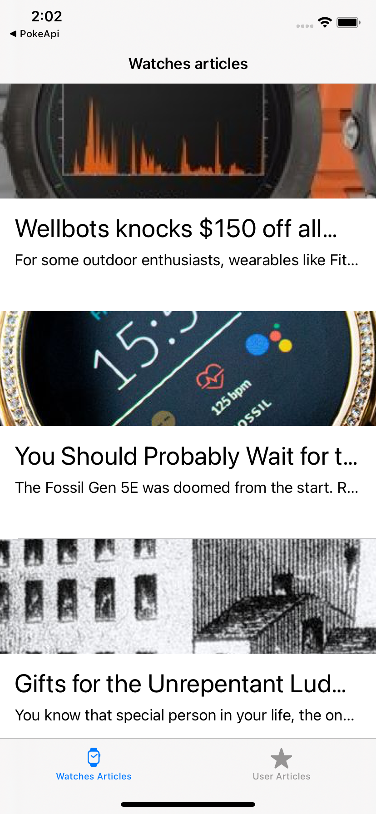
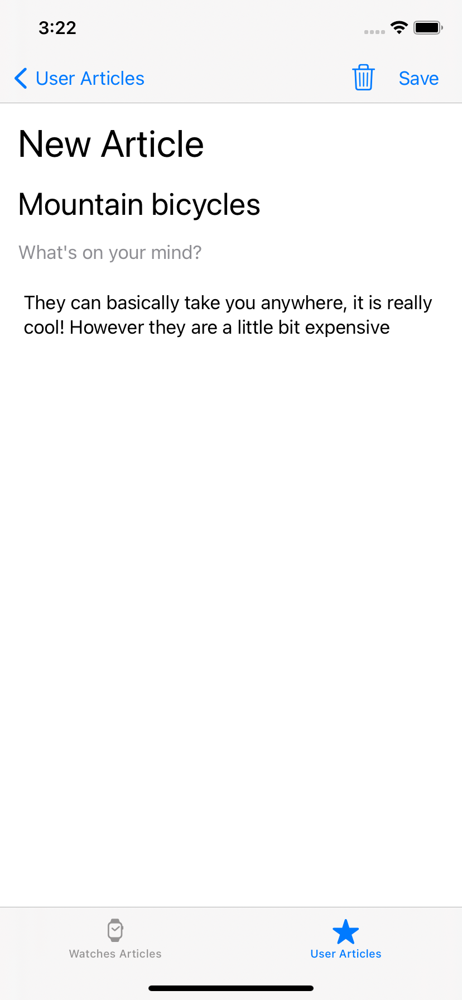

# WatchBlogger iOS

### Overview

The purpose of this application is to demostrate the usage of `Realm` and `Alamofire` to build and application that allows the user to see watches articles from `NewsAPI`

### Installation

Once you clone this repository make sure you are running on `Xcode 12.3` or newer and have [CocoaPods](https://guides.cocoapods.org/using/getting-started.html#getting-started) installed.

The next step would be to run `pod install` to download all the dependencies the app will use, and finally check the project by opening `WatchBloggeriOS.xcworkspace`

The next step would be to add your own API key inside the [Constants](/WatchBloggeriOS/Constants.swift) file, for simplicity of this demo, you will find my own API key inside the [env.sample](./env.sample) file

### Testing

The current state of the application has testing coverage for the Realm database controller, more updates to come soon.

Testing stack consist of:

- [Quick](https://github.com/Quick/Quick.git)
- [Nimble](https://github.com/Quick/Nimble)
- [Spry](https://github.com/Rivukis/Spry)

### Linter
This application uses [Swiftlint](https://github.com/realm/SwiftLint) for code linting, it gets installed once we set up our `pods` and will run `swiftlint` whenever we run the application.

__Recommended__: We can also run

```sh
./Pods/SwiftLint/swiftlint autocorrect
```

to have our `swiftlint` correct some warnings and enforce code style.

### xUnique

In order to avoid very complicated merge conflicts, this project works also with [xUnique](https://github.com/truebit/xUnique), please refer to the linked repository to install and follow the steps to use it, the command used for this application is:

```sh
xunique -s -p WatchBloggeriOS.xcodeproj
```

This step is optional but if you add a new file or modify the `xcodeproj` file then it is recommended to run `xunique` for consistency.

### Demo

A video demo can be found [here](https://drive.google.com/file/d/1ixzwMB_qznS-QUC9UtnF0KHy3X1jEjwi/view?usp=sharing)

Finally here are some screenshots attached:




